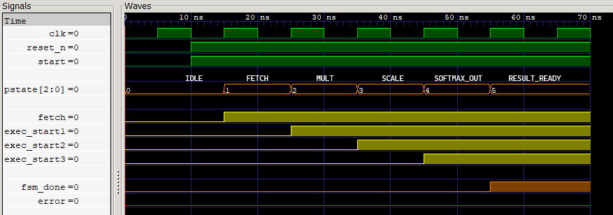

# **RTL Implementation of Attention Architecture**

## **Specifications**

- Input vectors <b>X<Q,K,V></b> and learned weight matrices <b>W<Q,K,V></b> taken from text files.
- Compute <b>Q = XQ * WQ, K = XK * WK, and V = XV * WV</b> using Matrix Multiplication Engine.
- Scale attention score, <b>S = QK^T / sqrt(dk)</b>.
- Apply <b>softmax(QK^T/sqrt(dk))</b> normalization.
- Output, <b>Attention (Q, K, V) = softmax(QK^T/sqrt(dk)) * V</b>.
- FSM and Counter controlled states/ computational blocks.

## **I/O Files Hierarchy**

```text
├── inputs                        // Input matrices stored here
│   ├── WK.txt
│   ├── WQ.txt
│   ├── WV.txt
│   ├── XK.txt
│   ├── XQ.txt
│   └── XV.txt
├── output                        
    ├── attention_script.txt      // Output generated by test_script.py
    ├── attention_testbench.txt   // Output generated by RTL and Testbench
    ├── attention_waveform.vcd    // Output waveform dump

```
Example of an input file, `./inputs/WK.txt`
```text
2.57 0 -1 34 5
-4.22 6 7.51 -2 1
8 -3.19 0 4 -5
```


<big><b>Each element in a matrix row should be separated by a `single space`, and each row must be separated by a `newline`. The dimension of any matrix `MUST BE` defined manually inside `./rtl/define.sv` file.</b></big>


Example of output file, `./output/attention_script.txt`
```text
-17.090000 32.840000
-14.460000 22.722000
-17.090000 32.840000

```

Example of output file, `./output/attention_testbench.txt`
```text
-17.1016 32.8477
-14.4727 22.7266
-17.1016 32.8477

```
<span style="color:green">
<big> <b>Output generated by the design is the same as the output generated by the Python file.</b></big>
</span>


## **User-Defined Parameters**

Timing and configuration values has to be modified through `./rtl/define.sv`:

```text
/*-------------------------------------
   Data Size and Matrices dimensions
--------------------------------------*/
`define BUS_WIDTH    4                  // exec_cycle counter BUS width, max count = 2^BUS_WIDTH - 1
`define DATA_WIDTH  32                  // Data BUS width (size of each element in matrices)

`define ROW_XQ       3                  // XQ matrix rows
`define COL_XQ       4                  // XQ matrix columns

/*-------------------------------------
            User defines
-------------------------------------*/
`define CLK_HALF_PERIOD           5     //  10 unit clock period
`define FRAC_POINT                8     //  Fixed point scaling to Qm.n, where m is integer bits and n is frac bits
`define SCALE_NR_STEPS            8     //  Newton-Raphson approximation steps to calculate S = QK^T/sqrt(dk)
`define EXP_SERIES_LN            26     //  Taylor's series for e^r = sum of N (r^n / n!) length
`define EXP_SERIES_LN2          177     //  ln(2) approx value in Q8.8 format (≈ 0.693 * 2^8 = 177)        

/*------------------------------------
        FSM State Exec Cycle
------------------------------------*/
`define EXEC_IDLE                 1
`define EXEC_DATA_FETCH           1
`define EXEC_MATRIX_MULT          1
`define EXEC_SCALED_ATTEN_SCORE   1
`define EXEC_OUTPUT_MAC           1
```

## **Architectural Overview**
<big><b>1. block_dataFetch</b></big></br>
Fetches and stores weight matrix W_{Q,K,V} and tokens X_{Q,K,V}.
  
<big><b>2. block_delay</b></big></br>
Inside real RTL `#delay` is not synthesizable. Hence, this counter block is used to mimic a delay of exec_cycle cycles of any particular state of the FSM. It asserts comp_result after the specified delay.

<big><b>3. block_MultMatStore</b></big></br>
Fetches two matrices from data fetch and does matrix multiplication. After getting Multiplied matrix, it stores into a buffer/ memory location. This block used parallely 3 times in a single clock cycle in order to calculate Q, K, V.

<big><b>3. block_ScaledQKT</b></big></br>
Computes Scaled QK^T, S = QK^T / sqrt(dk) by using `Newton-Raphson method` to find 1 / sqrt(dk).

<big><b>4. block_outputMAC</b></big></br>
Computes `Attention (Q,K,V) = softmax (QK^T / sqrt(dk) )` by using `Taylor's Series` to find `e^x`.

<big><b>5. block_fsm</b></big></br>
FSM States, latency, control signals,</br>
```text
  FSM_STATES        VALUES        MIN EXEC CYCLE        CONTROL-ed by                     ERRORs If                                   EXECUTES BLOCK
  -----------------------------------------------------------------------------------------------------------------------------------------------------------------------
  IDLE                0               1 Clk             start       = 1      Counter overflow                                 block_delay
  DATA_FETCH          1               1 Clk             fetch       = 1      Counter overflow                                 block_delay and block_dataFetch
  MATRIX_MULT         2               1 Clk             exec_start1 = 1      Counter overflow or dimension mismatch           block_delay and block_MultMatStore
  SCALED_ATTEN_SCORE  3               1 Clk             exec_start2 = 1      Counter overflow or dimension mismatch           block_delay and block_ScaledQKT
  OUTPUT_MAC          4               1 Clk             exec_start3 = 1      Counter overflow or dimension mismatch           block_delay and block_outputMAC
  RESULT_READY        5               -                                                     N/A
  ERROR               6               -           error in previous states
```

## **Output Waveform**
Used gtkwave to display `./output/attention_waveform.vcd`,



**Figure 1** — Attention mechanism state transition in waveform
